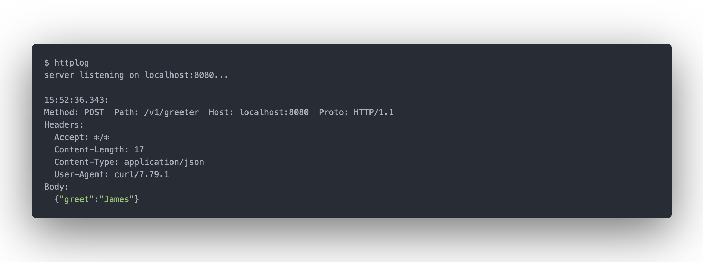

# httplog

httplog is a command line tool that launches a local HTTP server that logs all requests it receives, replying with a canned response.



## Install

Either download a [pre-built binary](https://github.com/jamescun/httplog/releases), or install from source (requires Go 1.19+):

```sh
go install github.com/jamescun/httplog
```

Alternatively on macOS, you can install httplog using the [Homebrew](https://brew.sh) package manager:

```sh
brew install jamescun/formulas/httplog
```

## Usage

```
httplog v1.0.0

httplog is a command line tool that launches a local HTTP server that logs all
requests it receives, replying with a canned response.

Usage: httplog [options...]

Options:
  --help                        show helpful information
  --listen         <host:port>  configure the listening address for the HTTP
                                server (default localhost:8080)
  --response       <text>       configure the canned body sent in response to
                                all requests (default none)
  --response-code  <code>       configure the HTTP status code sent in response
                                to all requests (default 200)
  --json                        log all requests as JSON rather than human
                                readable text
```

### Examples

Run with no options, a server will be launched on `localhost:8080`, answering no body and an HTTP 200 status code to all requests.

To configure the HTTP status code, use the `--response-code <code>` option, i.e. for a HTTP 500 Internal Server code:

```sh
$ httplog --response-code 500

$ curl -v http://localhost:8080
HTTP/1.1 500 Internal Server Error
```

To configure the response body, use the `--response <text>` option, i.e. to response the text `hello world` to all requests:

```sh
$ httplog --response "hello world"

$ curl http://localhost:8080
Hello World
```

If you would prefer JSON output, rather than human-readable text, use the `--json` option.
